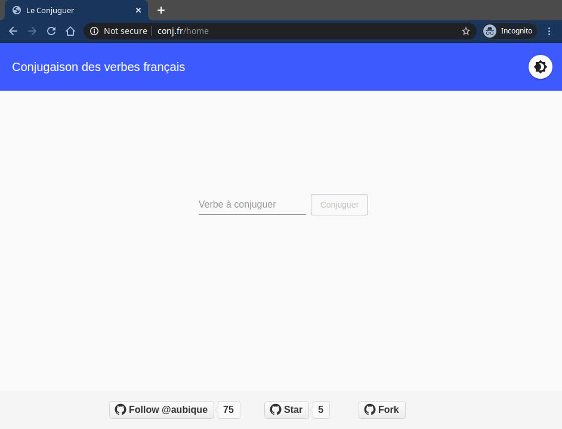

# Conjugator for French Verbs

Web application that helps mastering French verbs.

Check out the [Live Version](http://www.conj.fr)
hosted on Amazon Web Services.

## Using Conjugator

Verbs are conjugated in 4 verbal moods:
1. Indicative _(indicatif)_
2. Subjunctive _(subjonctif)_
3. Conditional _(conditionnel)_
4. Imperative _(impératif)_

You can type either a _infinitive_ form or any other correct form of the
verb to get it conjugated in all French tenses.

| Welcome page | Table page with French tenses |
|---|---|
|  |  |

## Technology Stack

This project constitutes a sort of an REST API-backed Single Page
Application (SPA).

### Front-End:
- Angular 9
- Angular Material UI
- Angular Flex-Layout

### Back-End:
- Spring Boot 2.2
- Spring Data JPA
- PostgreSQL
- Gradle 6
- Lombok
- JUnit 5

## Development

You can run, test and develop this project locally.

To run the final server there are several ways to deploy the project.

### JAR Package

If you'd like to build the executable JAR you can build it with Gradle:
```
./gradlew build -x test
```

> The `default` Gradle profile is set solely
>for deployment on AWS instance with RDS

Then run the server with `dev` Spring profile for local deploy:
```
java -jar -Dspring.profiles.active=dev conj-api/build/libs/*.jar
```

Navigate to `localhost:8080` to see the Angular project home page.

### Gradle Task

While developing either Spring Boot server for REST API or
Angular UI, the servers may be started and developed independently.

To start the Spring Boot server on `localhost:8080`:
```
./gradlew bootRun
```

To start the Angular Webpack dev-server on `localhost:4200` with
redirect to the local REST API:
```
./gradlew npm_start
```

### Database

For deployment on your machine you may need to manually initialize
a local PostgreSQL database.

To do that execute these DDL and DCL commands:

```sql
DROP USER IF EXISTS 'idea';
CREATE USER idea WITH ENCRYPTED PASSWORD 'idea';

CREATE DATABASE IF NOT EXISTS sfconj;
GRANT ALL PRIVILEGES ON DATABASE sfconj TO idea;
```

> To change datasource settings edit the properties-file located in
>`resources/application-dev.properties`
